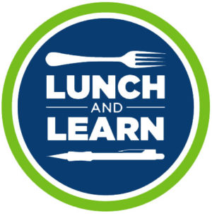

<!-- Improved compatibility of back to top link: See: https://github.com/othneildrew/Best-README-Template/pull/73 -->
<a name="readme-top"></a>
<!--
*** Thanks for checking out the Best-README-Template. If you have a suggestion
*** that would make this better, please fork the repo and create a pull request
*** or simply open an issue with the tag "enhancement".
*** Don't forget to give the project a star!
*** Thanks again! Now go create something AMAZING! :D
-->

<!-- PROJECT SHIELDS -->
<!--
*** I'm using markdown "reference style" links for readability.
*** Reference links are enclosed in brackets [ ] instead of parentheses ( ).
*** See the bottom of this document for the declaration of the reference variables
*** for contributors-url, forks-url, etc. This is an optional, concise syntax you may use.
*** https://www.markdownguide.org/basic-syntax/#reference-style-links
-->
[![Contributors][contributors-shield]][contributors-url]
[![Forks][forks-shield]][forks-url]
[![Stargazers][stars-shield]][stars-url]
[![Issues][issues-shield]][issues-url]
[![MIT License][license-shield]][license-url]
[![LinkedIn][linkedin-shield]][linkedin-url]

<!-- PROJECT LOGO -->
<br />
<div align="center">
  <a href="https://github.com/garrettgregor/lunch_and_learn">
    
  </a>

<h3 align="center">Lunch and Learn</h3>

  <p align="center">
    An api for users to discover recipes, how to cook them, and save their favorites using an api key.
    <br />
    <a href="https://github.com/garrettgregor/lunch_and_learn"><strong>Explore the docs »</strong></a>
    <br />
    <br />
    <a href="https://github.com/garrettgregor/lunch_and_learn">View Demo</a>
    ·
    <a href="https://github.com/garrettgregor/lunch_and_learn/issues">Report Bug</a>
    ·
    <a href="https://github.com/garrettgregor/lunch_and_learn/issues">Request Feature</a>
  </p>
</div>

<!-- TABLE OF CONTENTS -->
<details>
  <summary>Table of Contents</summary>
  <ol>
    <li>
      <a href="#about-the-project">About The Project</a>
      <ul>
        <li><a href="#built-with">Built With</a></li>
      </ul>
    </li>
    <li>
      <a href="#getting-started">Getting Started</a>
      <ul>
        <li><a href="#prerequisites">Prerequisites</a></li>
        <li><a href="#installation">Installation</a></li>
      </ul>
    </li>
    <li><a href="#usage">Usage</a></li>
    <li><a href="#roadmap">Roadmap</a></li>
    <li><a href="#contributing">Contributing</a></li>
    <li><a href="#license">License</a></li>
    <li><a href="#contact">Contact</a></li>
    <li><a href="#acknowledgments">Acknowledgments</a></li>
  </ol>
</details>

<!-- ABOUT THE PROJECT -->
## About The Project

![Lunch and Learn Screenshot][product-screenshot]
This is an api based application that allows users to discover new foods, how to cook them and learn a little bit about a different culture.

<p align="right">(<a href="#readme-top">back to top</a>)</p>

### Built With

* 
* 
* 
* [](https://github.com/rubocop/rubocop)
* [](https://rubystyle.guide)
* [Readme Template](https://github.com/othneildrew/Best-README-Template)

<p align="right">(<a href="#readme-top">back to top</a>)</p>

<!-- GETTING STARTED -->
## Getting Started

1. Fork or clone a copy of this repo, then run the following commands from the project directory in your terminal:

    ```zsh
    bundle install
    rails db:create{drop,create,migrate,seed}
    ```

### Prerequisites

* Ruby 3.2.2
* Rails 7.0.6
* Postgresql 14

### Installation

1. Get a free API Key and/or Application Keys at:
    1. [Edamam](https://developer.edamam.com/edamam-recipe-api)
    1. [Youtube](https://developers.google.com/youtube/v3/getting-started)
    1. [Unsplash](https://unsplash.com/documentation)
    1. [API Ninjas](https://api-ninjas.com/register)

1. Clone the repo

    ```zsh
    git clone https://github.com/garrettgregor/lunch_and_learn.git
    ``````

1. Install NPM packages

    ```zsh
    bundle install
    ```

1. Enter your Keys in `application.yml`

    ```yml
    EDAMAM_APP_KEY: <edamam_app_key>
    EDAMAM_APP_ID: <edamam_app_id>
    YOUTUBE_API_KEY: <youtube_key>
    UNSPLASH_API_KEY: <unsplash_authorization_token>
    API_NINJA_API_KEY: <api_ninja_x_api_key>
    ```

<p align="right">(<a href="#readme-top">back to top</a>)</p>

<!-- USAGE EXAMPLES -->
## Usage

Users can:

* Register and Login
![Registration][registration-screenshot]
![Log In][log_in-screenshot]
* Discover New Recipes from Random Countries
![Discover][product-screenshot]
![Learning Resources][learning_resources-screenshot]
* Save Favorite Recipes
![Favorites][favorites-screenshot]

<p align="right">(<a href="#readme-top">back to top</a>)</p>

<!-- ROADMAP -->
## Roadmap

* [ ] Validate countries using the [Rest Countries API](https://restcountries.com/)
* [ ] Add an endpoint to delete a favorite
* [ ] Utilize caching or background workers to optimize api calls
  * [ ] Deploy on Render
* [ ] Build a front end using React


See the [open issues](https://github.com/garrettgregor/lunch_and_learn/issues) for a full list of proposed features (and known issues).

<p align="right">(<a href="#readme-top">back to top</a>)</p>

<!-- CONTRIBUTING -->
## Contributing

Contributions are what make the open source community such an amazing place to learn, inspire, and create. Any contributions you make are **greatly appreciated**.

If you have a suggestion that would make this better, please fork the repo and create a pull request. You can also simply open an issue with the tag "enhancement".
Don't forget to give the project a star! Thanks again!

1. Fork the Project
2. Create your Feature Branch (`git checkout -b feature/AmazingFeature`)
3. Commit your Changes (`git commit -m 'Add some AmazingFeature'`)
4. Push to the Branch (`git push origin feature/AmazingFeature`)
5. Open a Pull Request

<p align="right">(<a href="#readme-top">back to top</a>)</p>

<!-- LICENSE -->
## License

Distributed under the MIT License. See `LICENSE.txt` for more information.

<p align="right">(<a href="#readme-top">back to top</a>)</p>

<!-- CONTACT -->
## Contact

Your Name - [@garrettgregor](https://twitter.com/garrettgregor) - garrett.gregor@gmail.com

Project Link: [https://github.com/garrettgregor/lunch_and_learn](https://github.com/garrettgregor/lunch_and_learn)

<p align="right">(<a href="#readme-top">back to top</a>)</p>

<!-- ACKNOWLEDGMENTS -->
## Acknowledgments

* [Mike Dao](https://github.com/mikedao)
* [Erin Pintozzi](https://github.com/epintozzi)
![The 2303 Cohort][2303-cohort]

<p align="right">(<a href="#readme-top">back to top</a>)</p>

<!-- MARKDOWN LINKS & IMAGES -->
<!-- https://www.markdownguide.org/basic-syntax/#reference-style-links -->
[contributors-shield]: https://img.shields.io/github/contributors/garrettgregor/lunch_and_learn.svg?style=for-the-badge
[contributors-url]: https://github.com/garrettgregor/lunch_and_learn/graphs/contributors
[forks-shield]: https://img.shields.io/github/forks/garrettgregor/lunch_and_learn.svg?style=for-the-badge
[forks-url]: https://github.com/garrettgregor/lunch_and_learn/network/members
[stars-shield]: https://img.shields.io/github/stars/garrettgregor/lunch_and_learn.svg?style=for-the-badge
[stars-url]: https://github.com/garrettgregor/lunch_and_learn/stargazers
[issues-shield]: https://img.shields.io/github/issues/garrettgregor/lunch_and_learn.svg?style=for-the-badge
[issues-url]: https://github.com/garrettgregor/lunch_and_learn/issues
[license-shield]: https://img.shields.io/github/license/garrettgregor/lunch_and_learn.svg?style=for-the-badge
[license-url]: https://github.com/garrettgregor/lunch_and_learn/blob/master/LICENSE.txt
[linkedin-shield]: https://img.shields.io/badge/-LinkedIn-black.svg?style=for-the-badge&logo=linkedin&colorB=555
[linkedin-url]: https://linkedin.com/in/garrett-gregor
[product-screenshot]: images/discover_recipes.png
[registration-screenshot]: images/registration.png
[log_in-screenshot]: images/log_in.png
[learning_resources-screenshot]: images/learning_resources.png
[favorites-screenshot]: images/favorites.png
[2303-cohort]: images/2303.png
[Next.js]: https://img.shields.io/badge/next.js-000000?style=for-the-badge&logo=nextdotjs&logoColor=white
[Next-url]: https://nextjs.org/
[React.js]: https://img.shields.io/badge/React-20232A?style=for-the-badge&logo=react&logoColor=61DAFB
[React-url]: https://reactjs.org/
[Vue.js]: https://img.shields.io/badge/Vue.js-35495E?style=for-the-badge&logo=vuedotjs&logoColor=4FC08D
[Vue-url]: https://vuejs.org/
[Angular.io]: https://img.shields.io/badge/Angular-DD0031?style=for-the-badge&logo=angular&logoColor=white
[Angular-url]: https://angular.io/
[Svelte.dev]: https://img.shields.io/badge/Svelte-4A4A55?style=for-the-badge&logo=svelte&logoColor=FF3E00
[Svelte-url]: https://svelte.dev/
[Laravel.com]: https://img.shields.io/badge/Laravel-FF2D20?style=for-the-badge&logo=laravel&logoColor=white
[Laravel-url]: https://laravel.com
[Bootstrap.com]: https://img.shields.io/badge/Bootstrap-563D7C?style=for-the-badge&logo=bootstrap&logoColor=white
[Bootstrap-url]: https://getbootstrap.com
[JQuery.com]: https://img.shields.io/badge/jQuery-0769AD?style=for-the-badge&logo=jquery&logoColor=white
[JQuery-url]: https://jquery.com
[Postgresql.com]: https://www.postgresql.org/
[Postrgresql-url]: https://img.shields.io/badge/PostgreSQL-316192?style=for-the-badge&logo=postgresql&logoColor=white